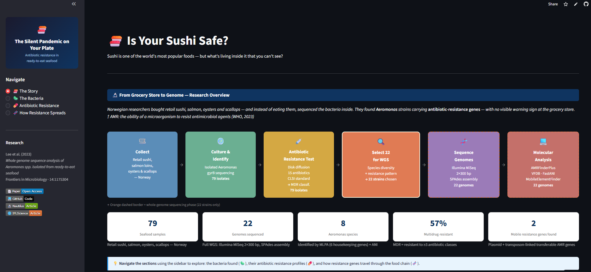

# 🧬 AMR Genomics — *Aeromonas* spp. in Ready-to-Eat Seafood

### *Whole-genome sequencing · Antimicrobial resistance · Virulence factors · Peer-reviewed publication*

[](https://doi.org/10.3389/fmicb.2023.1175304)
[](https://www.ncbi.nlm.nih.gov/bioproject/PRJNA877469)
[](https://python.org)
[](https://amrgenomicsaeromonas.streamlit.app/)
[](https://www.frontiersin.org/articles/10.3389/fmicb.2023.1175304)

---

> **Lee H-J, et al. (2023)**. Whole genome sequence analysis of *Aeromonas* spp. isolated from ready-to-eat seafood: antimicrobial resistance and virulence factors. *Frontiers in Microbiology*, 14:1175304.

Bioinformatics pipeline and downstream Python analysis from a peer-reviewed WGS study characterising AMR, virulence factors, and mobile genetic elements (MGEs) in *Aeromonas* spp. isolated from ready-to-eat seafood in Norwegian retail markets.

---

## 🖥️ Streamlit Application

[](https://amrgenomicsaeromonas.streamlit.app/)

**Live app →** [amrgenomicsaeromonas.streamlit.app](https://amrgenomicsaeromonas.streamlit.app/)



An interactive 4-page data explorer for the WGS dataset: the research story, species distribution + ANI heatmap, AMR gene profiles (phenotypic + genotypic), and MGE co-localisation case studies.

---

## 📌 Overview

*Aeromonas* species are emerging opportunistic pathogens increasingly associated with foodborne illness, yet they remain largely unregulated in EU food safety legislation. This project provides the first WGS-level characterisation of *Aeromonas* diversity and AMR burden in Norwegian ready-to-eat seafood — directly relevant to EFSA risk assessment and One Health AMR surveillance frameworks.

| Capability | What this project demonstrates |
|---|---|
| **Domain knowledge → analysis design** | AMR gene interpretation, MGE co-localisation logic, and ANI species boundary decisions all derived from microbiology domain expertise |
| **Bioinformatics pipeline** | End-to-end WGS: QC → assembly → annotation → species ID → AMR + virulence profiling |
| **Reproducible Python analysis** | Five notebooks reproducing all paper figures, with interactive Plotly extensions and additional analyses not in the original paper |
| **Scientific communication** | Peer-reviewed publication; findings linked to EU food safety regulatory context |

---

## 🔬 Key Findings

| Dimension | Finding |
|---|---|
| **Species diversity** | 8 *Aeromonas* species identified across 22 isolates — MLPA + ANI (≥96% cutoff) |
| **AMR burden** | **57% multidrug-resistant (MDR)** across 79 isolates; MDR defined as resistance to ≥3 antibiotic classes (CLSI) |
| **Virulence** | >250 virulence genes characterised via VFDB; species-specific profiles resolved |
| **Horizontal transfer risk** | *qnrS2* (quinolone resistance) on IncQ1 plasmid in *A. rivipollensis* A539 |
| **Co-selection signal** | Tn521 + Class I integron co-localisation in *A. caviae* SU4 — mercury + antibiotic resistance co-selection implied |
| **Public data** | All 22 genome assemblies deposited at NCBI: [PRJNA877469](https://www.ncbi.nlm.nih.gov/bioproject/PRJNA877469) |

---

## 🗂️ Repository Structure

```
amr_genomics_aeromonas/
│
├── assets/
│   └── dashboard_preview.png      # Dashboard screenshot (README preview)
│
├── pipeline/                      # Upstream WGS analysis — documented bash scripts
│   ├── 01_assembly.sh             # Read QC (BBDuk) + assembly (SPAdes v3.15.4)
│   ├── 02_annotation.sh           # NCBI PGAP annotation (web submission)
│   ├── 03_mlpa.sh                 # Species ID: BLAST+ + MEGA11 (MLPA, NJ/ML trees)
│   ├── 04_ani.sh                  # ANI: FastANI + ANIclustermap
│   ├── 05_amr_profiling.sh        # AMR genes: AMRFinderPlus v3.10.45 + ResFinder v4.1
│   ├── 06_virulence_mge.sh        # Virulence (VFDB), plasmids, MGEs, genome maps
│   ├── 07_abricate.sh             # Multi-database cross-validation (Abricate)
│   └── README_pipeline.md         # Tool versions, environment setup, web tool URLs
│
├── analysis/                      # Downstream Python analysis — runnable notebooks
│   ├── 00_data_prep.ipynb         # Supplementary tables → clean DataFrames
│   ├── 01_species_id.ipynb        # ANI heatmap + species boundary validation (Fig. 2)
│   ├── 02_amr_profiling.ipynb     # Phenotypic + genotypic AMR; concordance analysis
│   ├── 03_virulence_analysis.ipynb# Virulence factor heatmap + species comparison (Fig. 3)
│   └── 04_mge_amr_colocalization.ipynb  # MGE burden + AMR co-occurrence network (Fig. 4)
│
├── data/
│   ├── raw/                       # Supplementary tables (S1–S4) + pipeline outputs
│   │                              # Genome assemblies: download from NCBI PRJNA877469
│   └── processed/                 # Clean CSVs + figures generated by notebooks (committed)
│
├── streamlit_app.py               # Interactive data explorer
├── requirements.txt
└── README.md
```

---

## ⚙️ WGS Pipeline

Raw Illumina paired-end reads (2×300 bp MiSeq, 22 isolates) → assembled genomes → annotated → species-resolved → AMR + virulence characterised.

```
Raw Illumina reads (2×300 bp MiSeq)
        │
        ▼
01_assembly.sh         BBDuk (adapter/quality trimming) + SPAdes v3.15.4
        │               → contigs.fasta (22 assemblies)
        ▼
02_annotation.sh       NCBI PGAP (web submission)
        │               → annotated GenBank files → deposited to NCBI
        ▼
03_mlpa.sh             BLAST+ + MEGA11 v11.0.10
        │               → MLPA tree (6 housekeeping genes, 4,172 bp)
        │               → NJ + ML, 1,000 / 100 bootstrap replicates
        ▼
04_ani.sh              FastANI + ANIclustermap
        │               → ANI matrix (30×30) + clustered heatmap
        │               → 19 representative strains selected (ANI < 99.9%)
        ▼
05_amr_profiling.sh    AMRFinderPlus v3.10.45 + ResFinder v4.1 (web)
        │               → AMR gene profiles (Table 1, Supp. S2)
        ▼
06_virulence_mge.sh    VFanalyzer/VFDB · PlasmidFinder v2.1
        │               MobileElementFinder v1.0.3 · Proksee
        │               → Virulence profiles · plasmid types · MGE tables
        ▼
07_abricate.sh         Multi-database cross-validation
                        VFDB · NCBI · ResFinder · PlasmidFinder · CARD · ARG-ANNOT
```

---

## 📊 Analysis Notebooks

The `analysis/` notebooks reproduce all major figures from the paper, with interactive Plotly extensions and additional analyses not included in the original publication.

| Notebook | Reproduces | Extended Analysis |
|---|---|---|
| `00_data_prep.ipynb` | — | Parses supplementary tables (S1–S4), ANI matrix, and VF heatmap source into 14 clean DataFrames in `data/processed/` |
| `01_species_id.ipynb` | Figure 2 (ANI heatmap) | Interactive Plotly heatmap; species boundary validation (ANI ≥ 96%); strain overview → `strain_summary.csv` |
| `02_amr_profiling.ipynb` | Table 1; Supp. S2 | MDR distribution by species; species × antibiotic resistance heatmap; **genotype–phenotype concordance scoring** across 79 isolates |
| `03_virulence_analysis.ipynb` | Figure 3 (VF heatmap) | Interactive heatmap; virulence score per strain → `virulence_scores.csv`; species-level VF category prevalence |
| `04_mge_amr_colocalization.ipynb` | Figure 4A (A539 plasmid), Figure 4B (SU4 integron); Supp. S4 | IS family × strain distribution heatmap; **AMR gene co-occurrence network** (Jaccard); IS element burden ranking |

All notebooks include cell-level comments linking code decisions to the published Methods section.

**Notebook execution order:**

```
00_data_prep.ipynb
    → data/processed/*.csv (required by all downstream notebooks)

01_species_id.ipynb
02_amr_profiling.ipynb        ← independent; all read from data/processed/
03_virulence_analysis.ipynb
04_mge_amr_colocalization.ipynb
```

---

## 🧰 Tech Stack

| Layer | Tools |
|---|---|
| **Language** | Python 3.10+ · R (original statistical analysis) |
| **Data wrangling** | pandas · numpy |
| **Visualisation (notebooks)** | matplotlib · seaborn · plotly |
| **Dashboard** | Streamlit |
| **Bioinformatics (pipeline)** | BBTools · SPAdes · BLAST+ · MEGA11 · FastANI · ANIclustermap · AMRFinderPlus · Abricate |
| **Web-based tools** | ResFinder v4.1 · VFanalyzer/VFDB · PlasmidFinder v2.1 · MobileElementFinder v1.0.3 · Proksee |

---

## ▶️ Setup and Run

```bash
# Clone the repository
git clone https://github.com/hyejeong0617/amr_genomics_aeromonas.git
cd amr_genomics_aeromonas

# Install Python dependencies
pip install -r requirements.txt

# Launch the interactive explorer
streamlit run streamlit_app.py
```

**Bioinformatics tools** (upstream pipeline — Linux/HPC):

| Tool | Version | Install |
|---|---|---|
| BBTools (BBDuk) | latest | `conda install -c bioconda bbtools` |
| SPAdes | v3.15.4 | `conda install -c bioconda spades` |
| BLAST+ | latest | `conda install -c bioconda blast` |
| MEGA | v11.0.10 | [megasoftware.net](https://www.megasoftware.net/) |
| FastANI | latest | `conda install -c bioconda fastani` |
| ANIclustermap | latest | `pip install ANIclustermap` |
| AMRFinderPlus | v3.10.45 | `conda install -c bioconda ncbi-amrfinderplus` |
| Abricate | latest | `conda create -n abricate abricate` (bioconda) |

Steps 05–06 also use web-based tools. URLs and thresholds are documented in `pipeline/README_pipeline.md`.

---

## 📂 Data Access

All genome assemblies are publicly available at NCBI.

| Resource | Link |
|---|---|
| NCBI BioProject | [PRJNA877469](https://www.ncbi.nlm.nih.gov/bioproject/PRJNA877469) |
| Genome accessions | JAOPLB000000000 – JAOPLW000000000 (22 assemblies) |
| Supplementary tables | [Paper DOI](https://doi.org/10.3389/fmicb.2023.1175304) (open access) |

```bash
# Download annotated assemblies via NCBI Datasets CLI
# conda install -c conda-forge ncbi-datasets-cli
datasets download genome accession JAOPLB000000000 JAOPLC000000000 \
    --include gbff,gff3,sequence \
    --filename aeromonas_genomes.zip
```

> **Note:** `data/processed/` (clean CSVs and figures) is already committed to this repository — the analysis notebooks run without any additional downloads. The NCBI download above is only needed if you want to reproduce the upstream bioinformatics pipeline from raw assemblies.

---

## 🔗 Related Projects

| Project | Domain | Type | Status |
|---|---|---|---|
| **This repo** | Microbial genomics · food safety | WGS pipeline · Python analysis · Streamlit | ✅ Live |
| [rasff_risk_predictor](https://github.com/hyejeong0617/rasff_risk_predictor) | EU regulatory notifications | ML pipeline · NLP · Streamlit | ✅ Complete |
| [foodborne_outbreaks_eda](https://github.com/hyejeong0617/foodborne_outbreaks_eda) | Food safety surveillance | EDA · entity normalisation · Streamlit | ✅ Live |

**The three projects form a connected portfolio** — analysing the food safety problem at three different scales: molecular genomics (this repo), population-level surveillance (foodborne EDA), and real-time EU regulatory signal (RASFF ML).

---

## 📄 Citation

```bibtex
@article{lee2023aeromonas,
  author  = {Lee, Hye-Jeong and others},
  title   = {Whole genome sequence analysis of {Aeromonas} spp. isolated from
             ready-to-eat seafood: antimicrobial resistance and virulence factors},
  journal = {Frontiers in Microbiology},
  volume  = {14},
  pages   = {1175304},
  year    = {2023},
  doi     = {10.3389/fmicb.2023.1175304}
}
```

---

## 📬 Contact

**Hye-Jeong Lee** — PhD · Food Microbiology & Data Science

[](https://linkedin.com/in/hyejeong-lee)
[](https://github.com/hyejeong0617)

*Open to Scientific Data Analyst and Regulatory Intelligence roles (Germany / Remote).*

*Bioinformatics pipeline run on NTNU HPC infrastructure as part of the OPTiMAT project.*
